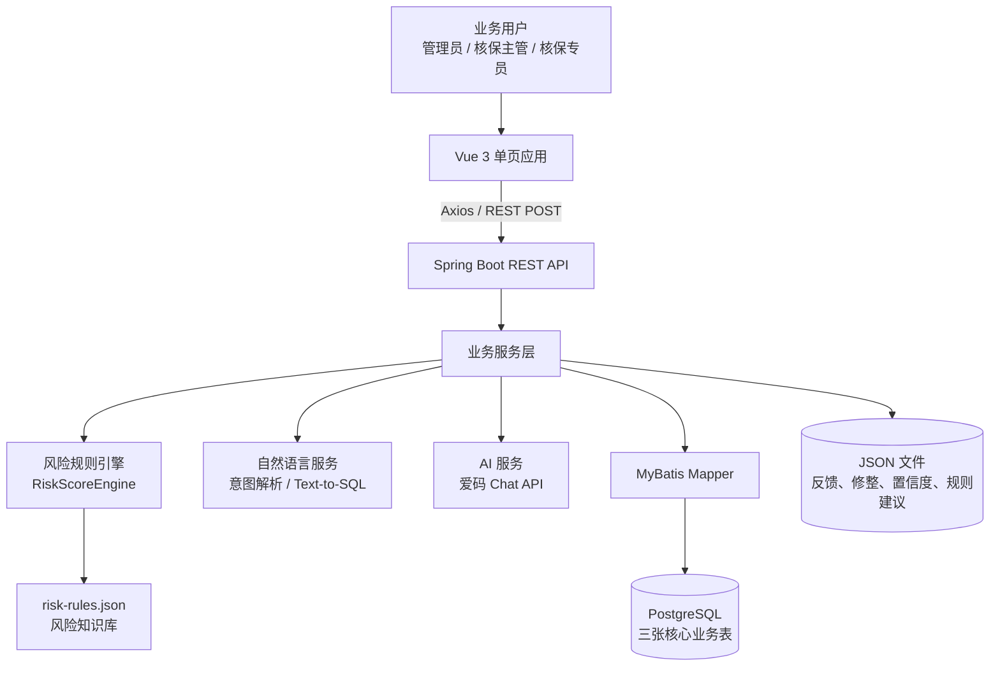
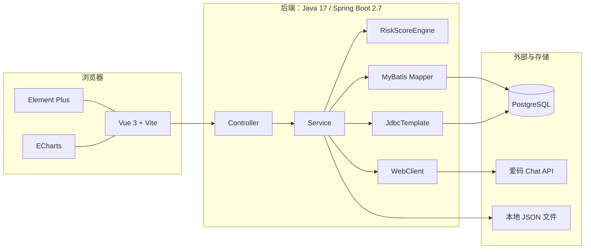
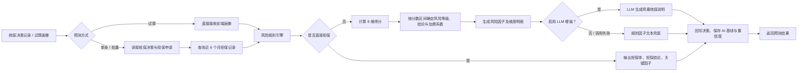
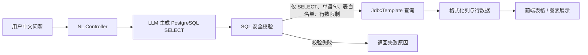
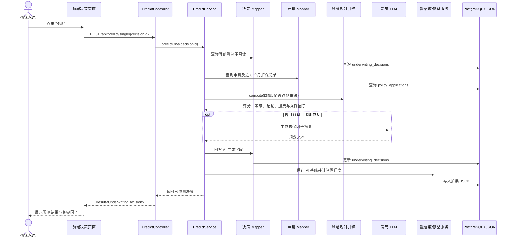
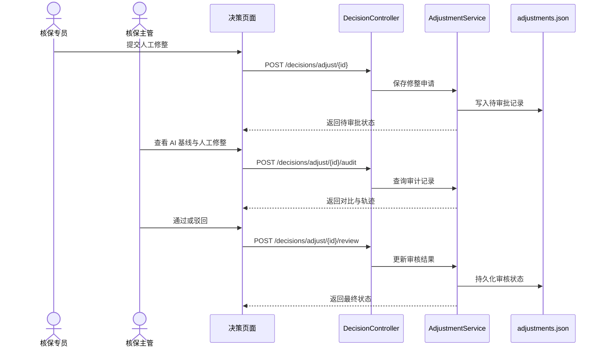
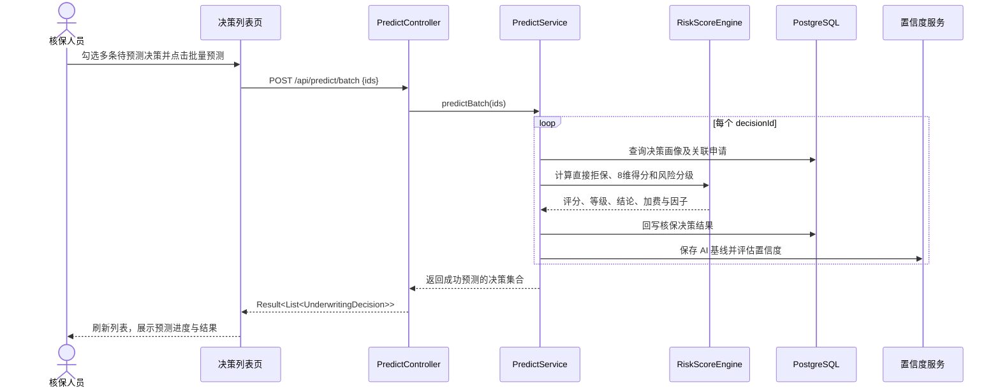
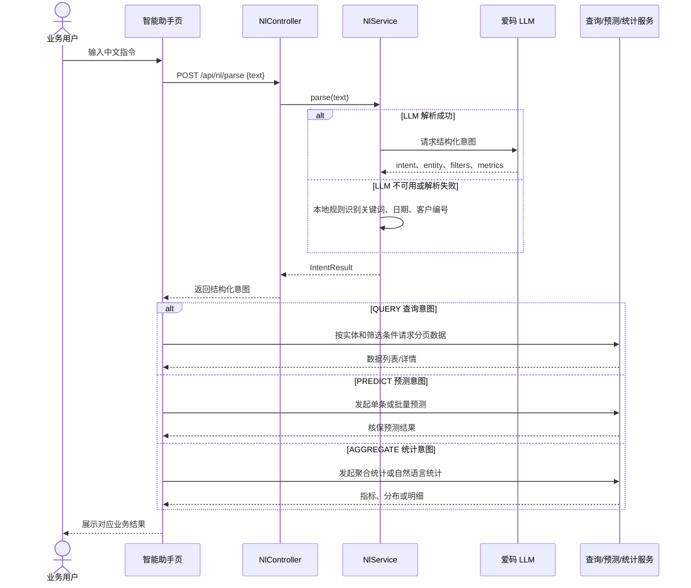
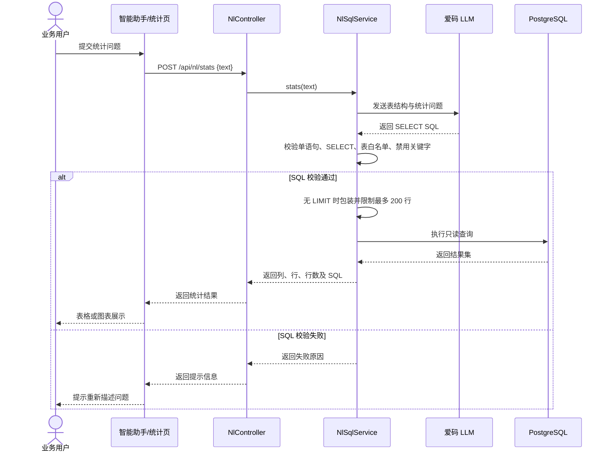
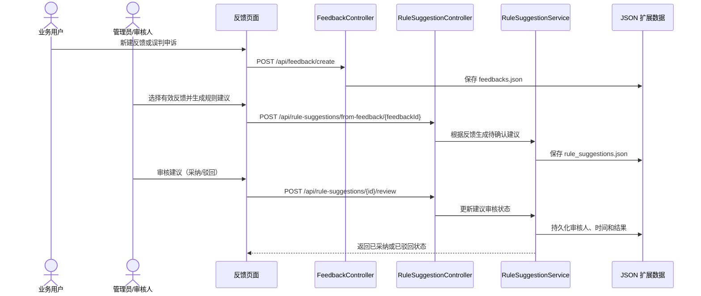

# AI 智能核保风险评估系统设计文档

> 文档版本：V1.0  
> 项目名称：基于 AI 的保险核保风险评估与智能分级系统  
> 文档类型：概要设计与详细设计说明  
> 更新日期：2026-09-20

## 1. 项目背景

传统保险核保依赖人工收集与判断投保人的健康、职业、生活习惯及病史等信息，处理效率较低，且不同核保人员可能对同一画像给出不一致的判断。另一方面，历史客户画像和理赔结果中蕴含了可量化的风险规律，但缺乏可直接服务一线人员的查询、预测和反馈闭环工具。

本项目以竞赛提供的历史客户画像、投保申请和核保决策数据为基础，建设一个可视化、可解释、可人工干预的智能核保原型。系统使用显性规则引擎完成稳定、可复核的风险评分；使用大语言模型（LLM）增强自然语言交互与风险因子说明，从而兼顾结果确定性和交互智能性。

## 2. 项目目标

1. 基于 8 个风险维度完成投保人风险评分、风险分级、核保结论、加费系数及关键风险因子输出。
2. 支持历史画像、投保申请、核保决策三类业务数据的查询、筛选、分页、详情、创建与编辑。
3. 支持单条预测、批量预测和不落库的规则试算。
4. 支持自然语言意图识别、自然语言统计查询，以及常规聚合统计展示。
5. 提供规则透明展示、人工修整与分级审核、AI 置信度路由、用户反馈到规则建议的闭环能力。
6. 满足竞赛演示中对规则展示、预测验证、数据处理、统计及 NLP 交互的验收要求。

## 3. 总体系统架构设计

系统采用前后端分离架构。浏览器端负责页面呈现、表单交互、角色菜单控制和图表展示；后端负责业务编排、规则计算、数据库读写、LLM 调用及文件型扩展数据的保存。PostgreSQL 保存三张核心业务表，JSON 文件保存反馈、人工修整、置信度和规则建议等扩展审计信息。



### 3.1 分层职责

| 层级 | 主要组件 | 职责 |
|---|---|---|
| 表现层 | Vue 页面、Element Plus、ECharts | 业务数据展示、表单编辑、图表、对话交互与操作反馈 |
| 路由与访问控制 | Vue Router、`roles.js` | 菜单过滤、页面路由守卫、演示角色切换 |
| API 层 | Spring MVC Controller | 接收请求、参数传递、统一返回 `Result<T>` |
| 业务层 | Service | 数据 CRUD、预测编排、统计、审批、反馈闭环 |
| 规则层 | `RiskScoreEngine`、`RuleService` | 读取规则知识库并执行确定性评分、分级和拒保判定 |
| 集成层 | MyBatis、WebClient、JdbcTemplate | PostgreSQL 访问、LLM 调用、自然语言 SQL 查询 |
| 数据层 | PostgreSQL、JSON、规则 JSON | 核心业务数据、扩展审计数据及规则配置 |

## 4. 技术架构图



## 5. 数据流设计

### 5.1 核保预测数据流



### 5.2 自然语言统计数据流



## 6. 前后端技术栈

| 范畴 | 技术 | 用途 |
|---|---|---|
| 前端框架 | Vue 3、Composition API | 单页应用与响应式状态管理 |
| 构建工具 | Vite | 本地开发、代理与生产构建 |
| UI 与图表 | Element Plus、ECharts | 表格、表单、弹窗、图表与交互组件 |
| 网络通信 | Axios | REST 请求、统一错误提示、超时控制 |
| 前端路由 | Vue Router | 页面路由及访问拦截 |
| 后端框架 | Spring Boot 2.7、Spring MVC | REST API、配置与业务容器 |
| 数据持久化 | MyBatis、PageHelper、PostgreSQL | SQL 映射、分页与核心业务数据存储 |
| HTTP 客户端 | Spring WebFlux WebClient | 调用爱码 LLM Chat API |
| 语言与构建 | Java 17、Maven | 后端开发、依赖管理与测试 |
| 配置与扩展数据 | YAML、JSON | 应用配置、风险规则和扩展审计数据 |

## 7. 模块设计

### 7.1 历史客户画像模块

- 管理 `customer_risk_his` 历史风险画像数据。
- 提供按创建/更新时间、客户属性等条件的分页筛选和详情查询。
- 支持人工创建、更新、删除数据，作为规则验证和业务查询的数据来源。

### 7.2 投保申请模块

- 管理 `policy_applications` 投保申请数据。
- 提供申请记录分页、详情及与核保决策的一对一关联查询。
- 支持新增、编辑、删除申请；申请状态包括待核保、核保中、已通过、已拒保和已撤单。

### 7.3 核保决策与预测模块

- 管理 `underwriting_decisions`，存放待预测画像和 AI 生成的核保结果。
- 支持规则试算、单条预测和批量预测。
- 预测后输出风险分数、风险等级、核保结论、加费系数与关键风险因子。
- 保存 AI 预测基线，并对结果进行置信度评估，辅助人工审核优先级安排。

### 7.4 风险规则模块

- 规则配置文件：`backend/src/main/resources/rules/risk-rules.json`。
- 规则维度：年龄、BMI、血压、吸烟、饮酒、个人病史、职业、家族病史。
- 直接拒保情形：重度个人病史、酒精成瘾、申请日前 6 个月内存在其它拒保申请等。
- 展示职业风险、家族病史和风险等级区间等规则，供核保人员透明复核。

### 7.5 智能助手与自然语言模块

- `NlService`：将用户指令解析为查询、预测或统计意图，并支持 LLM 解析失败时的本地规则兜底。
- `NlSqlService`：将统计问题转换为只读 SQL，进行白名单、安全关键字、单语句和最大行数校验后执行。
- 前端根据解析结果路由至相应数据列表、预测或统计操作。

### 7.6 统计分析模块

- 总览统计：申请总量、决策总量、通过率、拒保数、预测数、平均风险分等。
- 支持按时间、产品、状态、风险等级、职业、性别等白名单维度进行一至四维聚合。
- 前端以指标卡、饼图、柱状图、趋势和透视表形式呈现。

### 7.7 人工修整与审核模块

- 核保专员可提交对 AI 决策的人工修整。
- 核保主管可直接生效修整，或对待审批修整执行通过/驳回。
- 系统保留 AI 基线、人工变更、审批状态和审计轨迹，支持 AI 与人工结论的对比。

### 7.8 反馈驱动规则优化模块

- 用户可创建和处理问题反馈、投诉、误判申诉或功能建议。
- 反馈可一键转换为规则优化建议。
- 审核人可采纳或驳回建议，形成“反馈—规则建议—人工确认”的闭环。

## 8. 核心数据模型

| 表/文件 | 说明 | 关键内容 |
|---|---|---|
| `customer_risk_his` | 历史客户风险画像 | 客户基础信息、生活习惯、健康与家族病史、理赔标签、旧版评分 |
| `policy_applications` | 投保申请记录 | 产品、保额、保费、缴费方式、申请日期、申请状态 |
| `underwriting_decisions` | 核保决策结果 | 风险画像、风险评分、等级、结论、加费系数、关键因子 |
| `risk-rules.json` | 风险规则知识库 | 各维度加分、直接拒保规则、风险等级分段 |
| `adjustments.json` | 人工修整审计数据 | AI 基线、修整内容、审批状态与意见 |
| `confidence.json` | 置信度扩展数据 | 结果置信度和审核路由信息 |
| `feedbacks.json` | 用户反馈数据 | 反馈内容、优先级、状态和处理信息 |
| `rule_suggestions.json` | 规则优化建议 | 反馈来源、建议内容与采纳状态 |

核心关联关系：投保申请与核保决策通过 `policy_applications.profile_id = underwriting_decisions.application_id` 关联；两者均以 `customer_id` 标识投保客户。

## 9. 接口设计

### 9.1 统一约定

- 接口前缀：`/api`。
- 当前业务接口统一使用 `POST`，即使是查询类接口。
- 响应包装：`Result<T>`；成功时 `code = 0`，`data` 为业务数据，失败时返回 `message`。
- 前端开发服务默认运行于 `7001` 端口，代理 `/api` 至后端 `8080` 端口。

### 9.2 业务接口一览

| 模块 | 接口 | 说明 |
|---|---|---|
| 历史画像 | `POST /customer-risk/page` | 分页查询与筛选 |
| 历史画像 | `POST /customer-risk/detail/{profileId}` | 获取画像详情 |
| 历史画像 | `POST /customer-risk/create`、`/update/{profileId}`、`/delete/{profileId}` | 数据维护 |
| 投保申请 | `POST /applications/page` | 申请分页查询 |
| 投保申请 | `POST /applications/page-joined` | 申请与决策关联分页查询 |
| 投保申请 | `POST /applications/with-decision/{profileId}` | 单条申请及决策详情 |
| 投保申请 | `POST /applications/create`、`/update/{profileId}`、`/delete/{profileId}` | 数据维护 |
| 核保决策 | `POST /decisions/page`、`/detail/{decisionId}`、`/by-application/{applicationId}` | 决策查询 |
| 核保决策 | `POST /decisions/create`、`/update/{decisionId}`、`/delete/{decisionId}` | 决策数据维护 |
| 预测 | `POST /predict/preview` | 输入画像试算，不落库 |
| 预测 | `POST /predict/single/{decisionId}` | 单条预测并回写 |
| 预测 | `POST /predict/batch` | 批量预测，请求体为 `{ "ids": ["..."] }` |
| 规则 | `POST /rules/list`、`/rules/try-score` | 规则展示与规则引擎试算 |
| 统计 | `POST /stats/overview`、`/stats/aggregate` | 总览与多维聚合 |
| 自然语言 | `POST /nl/parse`、`/nl/stats` | 意图解析与自然语言统计 |
| 人工修整 | `POST /decisions/adjust/{decisionId}`、`/review`、`/audit` | 修整提交、审核和审计 |
| 反馈与建议 | `POST /feedback/*`、`/rule-suggestions/*` | 反馈处理与规则建议闭环 |

### 9.3 预测接口示例

请求：`POST /api/predict/preview`

```json
{
  "age": 48,
  "occupation": "货车司机",
  "bmi": 29.3,
  "bloodPressure": "轻度高血压",
  "smokingStatus": "吸烟",
  "drinkingStatus": "偶尔",
  "personalMedicalHistory": "高血脂",
  "familyMedicalHistory": "糖尿病"
}
```

响应中的核心字段包括：`totalScore`、`riskLevel`、`underwritingResult`、`premiumAdjustment`、`keyFactors` 和维度得分明细。

## 10. 核心业务流程时序图

### 10.1 单条核保预测



### 10.2 人工修整与审批



### 10.3 批量预测



### 10.4 自然语言指令解析与路由



### 10.5 自然语言统计（Text-to-SQL）



### 10.6 反馈转规则建议闭环



## 11. 核心业务流程说明

### 11.1 风险计分与分级

1. 系统取得核保决策画像；对已落库预测，同时读取对应申请以判断近期拒保历史。
2. 优先执行直接拒保判定。命中重度病史、酒精成瘾或近期拒保记录时，直接输出“拒保体”和“拒保”。
3. 未拒保时，分别按年龄、BMI、血压、吸烟、饮酒、个人病史、职业和家族病史进行累计加分。
4. 将总分映射至标准体、次标体 A 级、次标体 B 级、高风险体或拒保体，确定核保结论与加费系数。
5. 输出规则命中的因子与得分明细；LLM 可将其润色成简洁的核保建议，调用失败则自动使用规则结果。

### 11.2 规则试算、单条预测与批量预测的区别

| 方式 | 输入 | 是否写库 | 典型用途 |
|---|---|---:|---|
| 规则试算 | 前端直接提交画像 | 否 | 演示、录入前预估、自测 |
| 单条预测 | 已存在的决策 ID | 是 | 对某一待核保记录正式出具结果 |
| 批量预测 | 多个决策 ID | 是 | 对多个待核保记录集中处理 |

### 11.3 自然语言处理

用户输入中文指令后，系统优先调用 LLM 解析意图；若失败，使用本地关键字、日期和客户编号规则兜底。查询/预测意图由前端或业务模块路由，统计问题还可由 LLM 生成只读 SQL。SQL 执行前必须满足单条 `SELECT`、仅使用指定业务表、不含禁用关键字且最多返回 200 行等约束。

## 12. 前端页面说明

### 12.1 页面与路由

| 页面 | 路由 | 主要功能 | 可见角色 |
|---|---|---|---|
| 首页概览 | `/home` | 核心指标、风险与状态分布、业务概览 | 管理员、主管、专员 |
| 智能助手 | `/assistant` | 中文指令输入、意图识别、预测/查询/统计入口 | 管理员、主管、专员 |
| 历史客户画像 | `/history` | 1000 条历史画像的分页、筛选、详情与维护 | 管理员 |
| 投保申请记录 | `/applications` | 申请列表、筛选、详情、关联决策与新增编辑 | 管理员、主管、专员 |
| 核保决策结果 | `/decisions` | 决策列表、单条/批量预测、详情、修整和审批 | 管理员、主管、专员 |
| 数据汇总统计 | `/summary` | 总览指标、多维聚合、可视化统计 | 管理员、主管 |
| 风险计分规则 | `/rules` | 8 维评分细则、职业/家族史、等级区间与试算 | 管理员、主管、专员 |
| 用户反馈 | `/feedback` | 反馈工单、状态维护、规则建议与审核 | 管理员 |

根路径 `/` 自动重定向至 `/home`；未知路径也重定向至首页。角色仅用于竞赛演示的前端页面控制，当前通过浏览器 `localStorage` 保存。

### 12.2 主要页面交互

- **首页概览**：调用总览统计接口，展示申请量、通过率、风险等级分布等业务指标。
- **投保申请记录**：支持查询条件、分页、申请与决策联动详情，以及申请录入与修改。
- **核保决策结果**：支持勾选后批量预测；单条详情内展示画像、得分、等级、结论、因子、置信度和人工修整审计。
- **智能助手**：用户输入中文问题，系统解析后展示对应列表、预测任务或统计结果。
- **风险计分规则**：将 JSON 规则配置转换为可读表格，并提供输入画像后的即时规则试算。
- **用户反馈**：支持反馈状态更新，将有效反馈转为待确认规则优化建议。

## 13. 后端配置说明

配置文件路径：`backend/src/main/resources/application.yml`。

| 配置项 | 说明 |
|---|---|
| `server.port` | 后端 HTTP 服务端口，默认 `8080` |
| `spring.datasource` | PostgreSQL 数据源地址、账号、密码及驱动 |
| `mybatis` | Mapper XML 路径、实体别名、下划线转驼峰和类型处理器配置 |
| `pagehelper` | PostgreSQL 分页方言和合理化分页参数 |
| `ai.aicoder` | 爱码 Chat API 地址、模型、密钥、温度及最大输出长度 |
| `ai.predict.use-llm` | 是否为预测结果启用 LLM 风险因子摘要；失败时自动降级为规则文本 |
| `ai.nl.use-llm` | 是否为自然语言意图解析启用 LLM；失败时自动降级本地规则解析 |
| `logging.level.com.aicompetition` | 项目包日志级别 |

前端开发配置位于 `frontend/vite.config.js`：默认开发端口为 `7001`，`/api` 请求代理至 `http://localhost:8080`，并为 LLM 场景配置较长代理超时。前端 Axios 的全局超时同样设置为 30 分钟，智能统计接口单独使用 2 分钟超时。

## 14. 部署与运行说明

```bash
# 后端（Java 17）
cd backend
mvn spring-boot:run

# 前端（Node.js / npm）
cd frontend
npm install
npm run dev
```

启动后访问前端开发地址 `http://localhost:7001`。前端通过 Vite 代理调用后端 `8080` 端口的 API。

## 15. 测试说明

后端已包含以下单元测试：

- `RiskScoreEngineTest`：风险评分、直接拒保和分级规则。
- `PredictServiceTest`：单条预测编排与结果回写。
- `ConfidenceServiceTest`：AI 置信度计算与路由。
- `NlSqlServiceTest`：自然语言 SQL 的安全校验和限制规则。

推荐交付前执行：

```bash
cd backend && mvn test
cd frontend && npm run build
```
